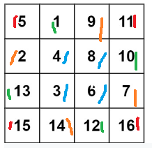

# Rotate Image

## 原題目:
```
You are given an n x n 2D matrix representing an image, rotate the image by 90 degrees (clockwise).

You have to rotate the image in-place, which means you have to modify the input 2D matrix directly. DO NOT allocate another 2D matrix and do the rotation.

Example 1:
    Input: matrix = [[1,2,3],[4,5,6],[7,8,9]]
    Output: [[7,4,1],[8,5,2],[9,6,3]]

Example 2:
    Input: matrix = [[5,1,9,11],[2,4,8,10],[13,3,6,7],[15,14,12,16]]
    Output: [[15,13,2,5],[14,3,4,1],[12,6,8,9],[16,7,10,11]]


```

## 思路1



如圖必須順時針旋轉,以外層來看,旋轉的次數是邊長減1,此時

```
red
(0,0)(0,3)     
(3,0)(3,3)

gree
(0,1)(1,3)
(2,0)(3,2)

orange
(0,2)(2,3)
(1,0)(3,1)
```
到了下一層邊長為上一層減2,此時左上角的點為上一層的左上角點行列各加1

```
blue
(1,1)(1,2)
(2,1)(2,2)
```
整裡一下每一層左上角開始的點為(x,y),當從每個顏色轉成下個此時每個數字必須往x或是y移動1

```
red
(0,0)(0,3)   (x,y)     (x,n - 1)   
(3,0)(3,3)=> (n - 1,y) (n - 1,n - 1)  

gree  
(0,1)(1,3)   (x,y + 1) (x + 1,n - 1)
(2,0)(3,2)=> (n - 1 - 1,y) (n - 1,n - 1 - 1)  

orange
(0,2)(2,3)   (x,y)         (x + 2,n - 1)   
(1,0)(3,1)=> (n - 1 - 2,y) (n - 1,n - 1 - 2) 
```
令每次移動k減化成,n每層最大的col index

```
(x,y + k)     (x + k,n - 1)   
(n - 1 - k,y) (n - 1,n - 1 - k)  
```


#### c++
<a href = "https://leetcode.com/submissions/detail/786820323/">100%</a> 
``` c++
class Solution {
public:
    void rotate(vector<vector<int>>& matrix) {
        int n = matrix.size();
        int side = n;
        int x = 0, y = 0;
        
        for (int side = n ; side > 1;side -=2 ){
            for(int k = 0;k < side - 1;k++){
                int temp = matrix[x][y + k];   
            
                //left top  = left bottom     
                matrix[x][y + k] = matrix[n - 1 - k][y];
                
                //left bottom  = rigt bottom     
                matrix[n - 1 - k][y] = matrix[n - 1][n - 1 - k];  
               
                //rigt bottom  = rigt top      
                matrix[n - 1][n - 1 - k] = matrix[x + k][n - 1];                    
              
                //rigt top  = left top      
                matrix[x + k][n - 1] = temp; 
            }
            n--;    
            x++;
            y++;            
        } 
    }
};
```  


