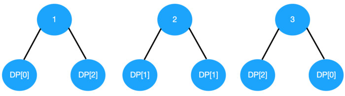

# Unique Binary Search Trees


## 原題目:
```
Given n, how many structurally unique BST's (binary search trees) that store values 1 ... n?

Example:

Input: 3
Output: 5
Explanation:
Given n = 3, there are a total of 5 unique BST's:

   1         3     3      2      1
    \       /     /      / \      \
     3     2     1      1   3      2
    /     /       \                 \
   2     1         2                 3
```

## 思路
重點是左邊値一定小於根,右邊的值一定大於跟<br>
定義一個dp[i]擁有i個node(1…i)的BST總共有幾種排法<br>
```
dp[0] = 1(空樹)
dp[1] = 1 (只有一個node)
node 等於 2的有2種情況
    1          2
      \       / 
       2     1 

node 等於3
   1    1          2         3     3  
    \    \        / \       /     /   
     3    2      1   3     2     1    
    /      \              /       \   
   2        3            1         2                  

```

有1,2和3三個node，分別用它們三個來當root
當root = 1時,左邊剩下dp[0]的組合,右邊是dp[2]的組合(1大的有2個)<br>
當root = 2時,左邊剩下dp[1]的組合,右邊是dp[1]的組合(比2大的有1個)<br>
當root = 3時,左邊剩下dp[2]的組合(比3小有兩個數字),右邊是dp[0]的組合<br>



## Code

#### Python

``` python
class Solution:
    def numTrees(self, n: int) -> int:
        dp = [0] * (n + 1)
        dp[0] = 1
        dp[1] = 1
        for i in range(2,n + 1):
            for j in range(1 , n + 1):
                dp[i] += dp[j - 1] * dp[i - j]
        
        return dp[-1]
        
```  


