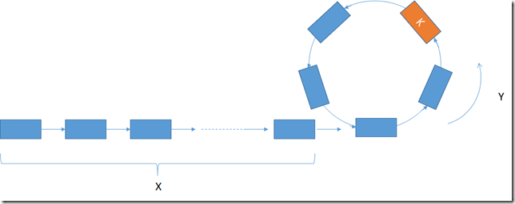
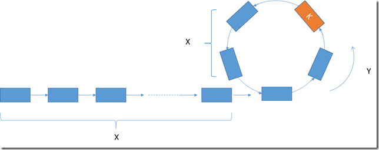

# Linked List Cycle II


## 原題目:
```
Given a linked list, return the node where the cycle begins. If there is no cycle, return null.

To represent a cycle in the given linked list, we use an integer pos which represents the position (0-indexed) in the linked list where tail connects to. If pos is -1, then there is no cycle in the linked list.

Note: Do not modify the linked list.

 

Example 1:

Input: head = [3,2,0,-4], pos = 1
Output: tail connects to node index 1
Explanation: There is a cycle in the linked list, where tail connects to the second node.


Example 2:

Input: head = [1,2], pos = 0
Output: tail connects to node index 0
Explanation: There is a cycle in the linked list, where tail connects to the first node.


Example 3:

Input: head = [1], pos = -1
Output: no cycle
Explanation: There is no cycle in the linked list.


```


## 思路

假設起點距離loop為X ,loop 一圈長度Y




1.判斷是否為loop </br>
假設有2個指針fast,slow ,fast 指針一次走2步,slow 指針一次一步
若如果兩個指針會在同一地方相遇,表示為loop</br>
若fast 指針走完,表示沒loop</br>

2.判斷loop 起始點</br>
假設在K點相遇,由於fast 步伐為slow 2倍</br>
slow 指針的路 = X + nY +K</br>
fast 指針的路 = X + mY+ K   </br>
</br>
所以 2( X + nY +K) = X + mY+ K  </br>

=> X + K =(m - 2n)Y</br>

K點往下走X會剛好回到Cycel 原點</br>

所以K點走X 會與原點走X遇到</br>





## Code


``` python
class Solution(object):
    def detectCycle(self, head):
        
        slow,fast = head ,head
        loop = False
        
        while fast and fast.next :            
            slow = slow.next            
            fast = fast.next.next            
            if slow == fast:
                break              
              
        if not fast or not  fast.next:
            return        
        
        slow2 = head
        while slow2 != slow:
            slow, slow2 = slow.next, slow2.next     
        
        return slow
```  

#### c++
``` c++
/**
 * Definition for singly-linked list.
 * struct ListNode {
 *     int val;
 *     ListNode *next;
 *     ListNode(int x) : val(x), next(NULL) {}
 * };
 */
class Solution {
public:
    ListNode *detectCycle(ListNode *head) {
        ListNode* slow = head;
        ListNode* fast = head;
        
        while(fast && fast->next){
            slow = slow->next;
            fast = fast->next->next;
            if(slow == fast)
                break;            
        }
        if(!fast || !fast->next)
            return nullptr;
        ListNode* curr = head;
        
        while(curr != slow){
            curr = curr->next;
            slow = slow->next;
        }    
        return curr;        
    }
};
```


